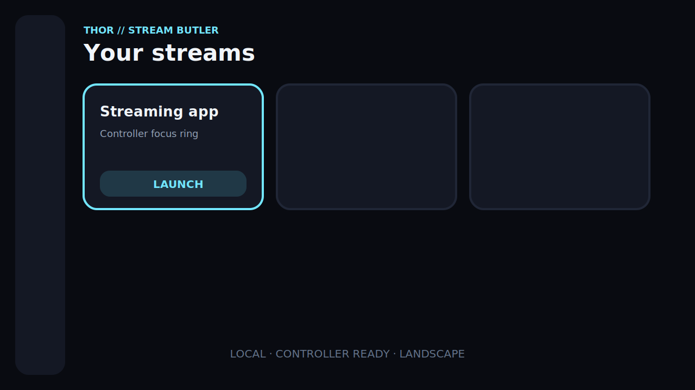
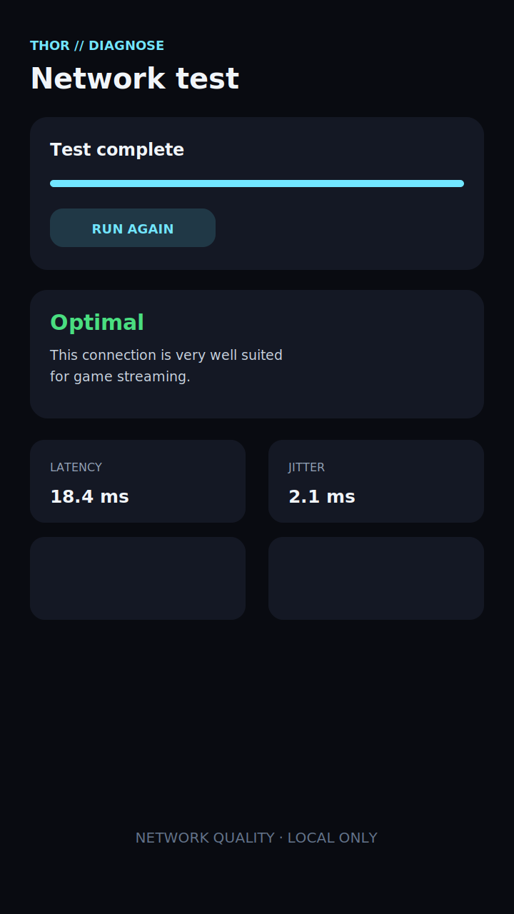
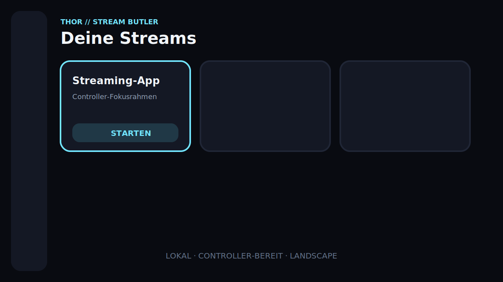
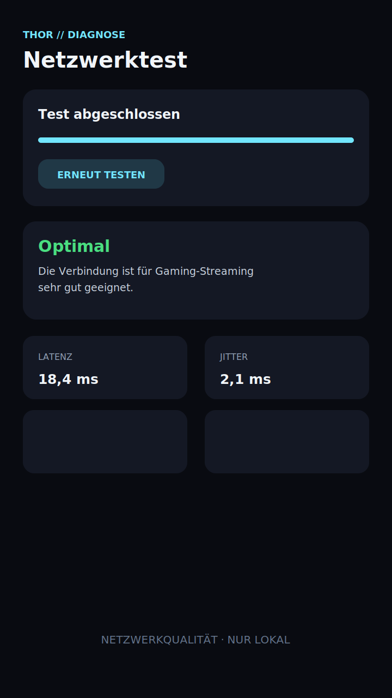

<div align="center">
  
  <h1>Thor Stream Butler</h1>
  <p><strong>Stream. Check. Launch. · Streamen. Prüfen. Starten.</strong></p>
  <p>The local, controller-first game-streaming launcher for Android handhelds.<br>Der lokale, controller-first Gaming-Streaming-Launcher für Android-Handhelds.</p>
  <p>
    <a href="https://strugglechen1337.github.io/thor-stream-butler/"><strong>English website</strong></a>
    ·
    <a href="https://strugglechen1337.github.io/thor-stream-butler/de/"><strong>Deutsche Website</strong></a>
    ·
    <a href="https://github.com/Strugglechen1337/thor-stream-butler/releases/tag/v0.9.0-alpha.1"><strong>Download v0.9.0-alpha.1</strong></a>
    ·
    <a href="#build"><strong>Build guide</strong></a>
    ·
    <a href="https://github.com/Strugglechen1337/thor-stream-butler/issues"><strong>Issues</strong></a>
    ·
    <a href="#optional-support"><strong>Support</strong></a>
  </p>
  <p>
    <a href="https://github.com/Strugglechen1337/thor-stream-butler/actions/workflows/android-ci.yml"></a>
    <a href="https://github.com/Strugglechen1337/thor-stream-butler/actions/workflows/pages.yml"></a>
    
    
    
    <a href="LICENSE"></a>
  </p>
</div>

**English** | [Deutsch](#deutsch)

## English

Thor Stream Butler brings installed game-streaming apps together, optionally
checks network quality before launch, and manages local streaming hosts with
Wake-on-LAN. The current codebase is a compilable MVP with no account, cloud
backend, advertising, tracking, or telemetry.

It is built for Android gaming handhelds such as **AYN Thor / Odin** and
**Retroid Pocket**, while remaining usable on Android phones, tablets, and
similar devices running Android 9 or newer.

> Local-first by design. Measurements, hosts, settings, and history stay on the device.

### Alpha download

The current installable development preview is available as
[v0.9.0-alpha.1](https://github.com/Strugglechen1337/thor-stream-butler/releases/tag/v0.9.0-alpha.1)
for Android 9 and newer. Download the APK and its SHA-256 checksum from the
release assets. The in-app interface is fully localized in English and German:
English is the default, German follows the system or per-app language setting
(Android 13+).

> **Alpha warning:** v0.9.0-alpha.1 is signed with the permanent Thor Stream
> Butler production key and updates v0.4.0-alpha.1 or newer in place. It cannot update
> the older debug-signed previews (v0.3 and earlier); export the configuration
> if needed, uninstall the old alpha, and then install v0.9.0-alpha.1 —
> uninstalling removes the old app's local data. Physical handheld validation
> is still pending.

### Screenshots

These are interface previews. They will be replaced with captures from tested
handheld hardware as the project moves toward its first release.

| Landscape dashboard | Portrait network test |
|---|---|
|  |  |

### Features

- Adaptive launcher UI for portrait and landscape orientation
- Full controller, D-pad, keyboard, and touch support
- Large focusable tiles with a clearly visible focus ring
- Selection of launchable Android apps through `PackageManager`
- Local storage of display name, package name, category, icon reference, and order
- Launch-intent validation with a clear error when an app is unavailable
- Optional network check before opening a streaming app
- Green, yellow, red, or gray quality rating with explanations and recommendations
- VPN-aware transport detection with a contextual quality recommendation
- Complete cancellable network test with live progress
- Local host management, TCP port checks, and Wake-on-LAN
- Curated streaming-port check for an explicitly entered host, without network scanning
- Per-tile local-host assignment and resolution, FPS, and bitrate profiles
- Optional dedicated Ethernet profile per tile, applied automatically on wired connections
- Network-aware streaming-profile recommendations based on all quality signals
- User-initiated Sunshine/Moonlight-compatible discovery through Android NSD
- Versioned JSON configuration export/import with optional history, strict size
  and value validation, and rollback if any part of an import fails
- IPv4, IPv6 (including bracketed and scoped addresses), and hostname support
- Room-backed history with filters, averages, a latency sparkline, comparable
  trends, and a local Wi-Fi stability comparison across saved measurements
- Optional privacy-safe diagnostic event log without network identifiers
- DataStore settings for launch behavior, diagnostics, and presentation
- Local, permissionless streaming session timer with the last session on the dashboard
- Quick Settings tile with the last network quality and one-tap test start
- Live controller test for buttons, D-pad, sticks, and triggers
- Battery level, charging state, and battery temperature during diagnostics

Initial streaming categories:

- GeForce NOW
- Xbox Cloud Gaming
- Xbox Remote Play / XBPlay
- PlayStation Remote Play / PXPlay
- Moonlight
- Steam Link
- Sunshine host
- Any user-selected Android app

Product names are used only to describe compatible categories. The project does
not bundle protected service logos. Icons for installed apps are loaded locally
through Android at runtime.

### How launch protection works

1. Focus and activate a launcher tile.
2. If enabled, Thor Stream Butler runs a short network check without a download test.
3. The app shows a color rating, explanation, and recommendation.
4. A green result can launch automatically after a short status display.
5. A yellow result displays a warning and then launches.
6. A red result offers **Launch anyway**, **Run again**, or **Cancel**.
7. A gray result means that Android or the network could not provide reliable measurements.

Every part of this flow can be adjusted in Settings.

### Network diagnostics

The diagnostic service uses public Android APIs and performs real measurement
attempts. Missing values stay `null` and are shown as unavailable or not
measurable; the app never invents plausible-looking results.

Depending on Android version, permissions, hardware, and network behavior, it can report:

- active transport: Ethernet, Wi-Fi, cellular, VPN, or another transport
- local IPv4 address and default gateway
- Wi-Fi SSID, frequency, link speed, and signal strength
- Android's validated internet status
- DNS resolution
- ping latency, jitter, and packet loss
- an optional short HTTPS download test
- reachability of an explicitly configured host and TCP port

Ping first uses Android's common `/system/bin/ping` executable with separate
process arguments. If it is unavailable, the service falls back to
`InetAddress.isReachable()`. Some devices and networks block ICMP; that is
reported as packet loss or an unavailable result instead of crashing the app.

Jitter is calculated as the average absolute difference between consecutive
successful latency measurements. Packet loss is
`(sent - received) / sent × 100`.

The optional download test is disabled by default. When enabled, the app
downloads time-limited test data over HTTPS from `speed.cloudflare.com`. The
provider can technically see the public IP address during that test. Thor
Stream Butler sends no account data and stores none of the response content.

### Quality rating

The quality evaluator lives in `core/network/QualityEvaluator.kt`, is independent
of Android components, and can be unit-tested directly. Thresholds are centralized
in `QualityThresholds` for later configurability.

Current defaults:

| Metric | Optimal / good | Warning | Problematic |
|---|---:|---:|---:|
| Latency | up to 30 ms | above 30 ms | above 60 ms |
| Jitter | up to 10 ms | above 10 ms | above 20 ms |
| Packet loss | 0% | above 0% | above 1% |
| Wi-Fi signal | 55% or higher | below 55% | below 35% |
| Wi-Fi link rate | 100 Mbit/s or higher | below 100 Mbit/s | below 25 Mbit/s |
| Measured download | 25 Mbit/s or higher | below 25 Mbit/s | below 10 Mbit/s |

The evaluator also considers transport type, 2.4/5/6 GHz Wi-Fi, validated
internet access, and host reachability. Download speed alone never determines
the overall rating. Ethernet and 5/6 GHz Wi-Fi are preferred; cellular and
2.4 GHz Wi-Fi produce a contextual note even when the other metrics are good.
An active VPN is detected before its underlying transport and adds a non-critical
warning. The measured latency, jitter, packet loss, and host reachability still
determine whether the connection is actually problematic. Link rate and download
speed affect the rating only when Android or the optional test supplied a real value.

### Technical foundation

- Kotlin with Coroutines and Flow
- Jetpack Compose and Material 3
- Gradle Kotlin DSL and a version catalog
- Minimum SDK 28
- Compile / target SDK 37 (Android 17)
- Android Gradle Plugin 9.3.0 with built-in Kotlin
- MVVM and Repository Pattern
- Hilt and KSP
- Room for launcher entries, hosts, and measurement history
- Preferences DataStore for settings
- Navigation Compose

WorkManager is deliberately not included in the MVP. Diagnostics and app launch
are explicit, visible user actions, and there is currently no reliable background
job that would justify the dependency.

### Project structure

The MVP uses a single `app` module. Package boundaries are designed so features
can later move into separate Gradle modules without a major rewrite.

```text
app/src/main/java/de/thorstream/butler/
├── core/
│   ├── common/          Result and error types
│   ├── designsystem/    Thor theme and colors
│   ├── network/         Calculations, rating, WOL packet
│   └── validation/      Host, IPv4, and MAC validation
├── data/
│   ├── database/        Room entities, DAOs, and database
│   ├── datastore/       Settings persistence
│   ├── di/              Hilt modules
│   ├── repository/      Android and Room repositories
│   └── service/         Network, ping, host, and WOL services
├── domain/
│   ├── model/           Android-independent models
│   ├── repository/      Repository interfaces
│   └── service/         Service interfaces
├── feature/
│   ├── dashboard/
│   ├── history/
│   ├── hosts/
│   ├── networktest/
│   └── settings/
└── navigation/          Adaptive app navigation
```

The central interfaces are `NetworkDiagnosticsService`, `PingService`,
`SpeedTestService`, `HostDiscoveryService`, `LocalHostDiscoveryService`,
`WakeOnLanService`, `ConfigurationTransferService`, `InstalledAppsRepository`,
`StreamingEntryRepository`, `NetworkHistoryRepository`, and
`DiagnosticLogRepository`.

### Build

#### Requirements

- JDK 17
- Android SDK Platform 37
- Android SDK Build Tools 36.0.0 or newer
- Android Studio with Android 17 support, or an equivalent command-line SDK installation

The repository includes Gradle Wrapper 9.6.1; no global Gradle installation is required.
The wrapper distribution and all resolved build dependencies are protected by
SHA-256 verification metadata in `gradle/verification-metadata.xml`.

#### Local SDK configuration

Create an untracked `local.properties` file in the project root:

```properties
sdk.dir=C\:\\Users\\NAME\\AppData\\Local\\Android\\Sdk
```

On macOS or Linux, for example:

```properties
sdk.dir=/Users/NAME/Library/Android/sdk
```

#### Compile and test

Windows PowerShell:

```powershell
./gradlew.bat :app:assembleDebug
./gradlew.bat :app:testDebugUnitTest
./gradlew.bat :app:assembleDebugAndroidTest
./gradlew.bat :app:lintDebug
./gradlew.bat :app:assembleRelease :app:bundleRelease :app:lintRelease
```

macOS or Linux:

```bash
./gradlew :app:assembleDebug
./gradlew :app:testDebugUnitTest
./gradlew :app:assembleDebugAndroidTest
./gradlew :app:lintDebug
./gradlew :app:assembleRelease :app:bundleRelease :app:lintRelease
```

The debug APK is generated at `app/build/outputs/apk/debug/app-debug.apk`.
Optimized local release builds use R8 and resource shrinking and produce an
unsigned APK plus AAB unless production signing is configured. See the
[release guide](docs/RELEASE.md) before distributing either artifact.

JVM tests run without a device. Instrumented Room repository tests are compiled
with `:app:assembleDebugAndroidTest` and can run on an emulator or device with
`connectedDebugAndroidTest`.

After an intentional dependency update, regenerate verification metadata with
the same full task set plus `--write-verification-metadata sha256`, review every
new checksum against the configured Google/Maven/Gradle source, and retain the
Linux, macOS, and Windows AAPT2 classifiers required by supported build hosts.

### Permissions

Dangerous permissions are requested only when the related feature is used.

| Permission | Android version | Purpose | Behavior without permission |
|---|---|---|---|
| `INTERNET` | All | DNS, ping fallback, TCP test, HTTPS test, Wake-on-LAN | Network diagnostics and host actions are unavailable |
| `ACCESS_NETWORK_STATE` | All | Active network, transport, and validated internet state | Basic diagnostics are unavailable |
| `ACCESS_WIFI_STATE` | All | Wi-Fi link data | Wi-Fi details are omitted |
| `ACCESS_COARSE_LOCATION` + `ACCESS_FINE_LOCATION` | Through Android 12L; manifest `maxSdkVersion=32` | SSID and Wi-Fi details on older versions; Android 12 requires both together | SSID and individual Wi-Fi values are omitted |
| `NEARBY_WIFI_DEVICES` | Android 13+ | Current Wi-Fi details, declared with `neverForLocation` | SSID and individual Wi-Fi values are omitted |
| `ACCESS_LOCAL_NETWORK` | Android 17+ when targeting SDK 37 | Explicit TCP/UDP communication, Android NSD host discovery, and Wake-on-LAN | Host discovery, host tests, and Wake-on-LAN are not executed; internet tests remain available |

`CHANGE_WIFI_MULTICAST_STATE` is intentionally not declared in the MVP because
the app delegates service discovery to Android's `NsdManager` and does not
acquire a raw multicast lock itself. UDP broadcast to an explicitly configured
Wake-on-LAN target does not require it. This decision will be reviewed if a
future Android version or discovery transport requires an app-managed lock.

The manifest's `<queries>` block is not a runtime permission. It limits package
visibility to activities with a launcher intent.

Further reading: [Android local network permission](https://developer.android.com/privacy-and-security/local-network-permission),
[Android Wi-Fi permissions](https://developer.android.com/develop/connectivity/wifi/wifi-permissions).

### Privacy and security

- No account or cloud backend
- No advertising, trackers, telemetry, or analytics SDKs
- No stored credentials
- No hidden Android APIs and no root access
- Hosts, network data, settings, and history stay in the private app sandbox
- Android backup is disabled for the MVP (`allowBackup=false`)
- Cleartext HTTP is disabled; the optional download test uses HTTPS
- Logs do not contain IP addresses, SSIDs, or MAC addresses
- Network operations use timeouts and respect coroutine cancellation
- Configuration exports are created only at a user-selected document location;
  they may contain sensitive host data and optional measurement history

Full notices: [Privacy policy](docs/privacy/index.html),
[MIT license](LICENSE), and [third-party notices](THIRD_PARTY_NOTICES.md).
Release preparation: [physical-device test plan](docs/PHYSICAL_TEST_PLAN.md) and
[store listing/Data safety draft](docs/STORE_LISTING.md).

Uninstalling the app removes the local database and DataStore settings through
Android. Measurement history can also be deleted separately inside the app.

### Known Android limitations

- Android or the device manufacturer may redact SSID and Wi-Fi metadata even after permission is granted.
- Wi-Fi link speed is a negotiated PHY value, not a real download-speed measurement.
- A target that blocks ICMP can look like packet loss. The reachability fallback varies by device.
- `NET_CAPABILITY_VALIDATED` is Android's view of internet access, not a guarantee that a particular streaming service is available.
- Wake-on-LAN only works when the host, firmware, network adapter, and router support broadcast or magic packets.
- The default `255.255.255.255` broadcast does not work on every network; each host can use a subnet broadcast or unicast target instead.
- Demo tiles use common package names. Manufacturer or store variants may use different identifiers and appear as not installed.
- The history keeps the latest 100 measurements and provides a compact latency sparkline, not a full analytics dashboard.
- Sunshine/Moonlight discovery only sees hosts advertising `_nvstream._tcp` on the same local network. It never scans the subnet.
- Streaming profiles and recommendations are guidance; third-party apps without a supported public configuration API are not modified.
- Wi-Fi comparison uses only saved measurements and available SSIDs. It does not
  scan nearby networks, and its confidence is limited when only a few measurements exist.

### Tests

The test suite covers:

- quality evaluation across green, yellow, red, and gray outcomes
- jitter and packet-loss calculations
- IPv4, IPv6, hostname, and MAC validation
- exact construction of the 102-byte Wake-on-LAN packet
- successful and failed network-test ViewModel flows
- no-active-network errors without invented measurements
- Room repositories for launcher tiles, hosts, and history
- Room schema migrations from version 1 through 3
- streaming-profile recommendations and comparable history trends
- dashboard pre-launch host integration and successful app launching
- configuration export/import validation, database/DataStore rollback, history
  retention, and privacy-safe diagnostic logging
- normalization of persisted diagnostic settings and safe fallbacks for
  forward-version Room enum values
- local Wi-Fi comparison grouping, ranking, missing-data handling, and ViewModel state
- D-pad focus movement between dashboard tiles on an Android emulator

Test fakes implement network service and settings interfaces without Android
network access. The latest validation run passed 60 JVM tests and 15 Android
instrumentation tests locally on Android 15. GitHub Actions builds debug and
optimized release variants, runs unit tests, both lint variants, and the same
15 Android tests on Android 9/API 28 and Android 15/API 35 in parallel, then
uploads APK, AAB, and reports. Workflow dependencies
are pinned to reviewed commit hashes and kept current through Dependabot;
dependency review blocks newly introduced vulnerabilities of moderate or higher severity.

### Roadmap after the MVP

- Home-screen widgets
- Backup to a local NAS
- Notifications for unstable connections
- Optional Windows companion service

### Language and release policy

Public GitHub documentation, project pages, changelogs, and release notes are
always maintained in **English and German**. A release is not complete until
both language sections describe the same behavior, limitations, and upgrade
information. See [CHANGELOG.md](CHANGELOG.md) and the
[release guide](docs/RELEASE.md).

### Transparency: AI-assisted development

The initial application, architecture, tests, documentation, and project website
were developed in collaboration with OpenAI Codex. The complete implementation
is public for review, and bug reports, focused pull requests, and technical
feedback are welcome.

### Thor family

Thor Stream Butler follows the same local-first and handheld-first philosophy as
[Thor ROM Butler](https://github.com/Strugglechen1337/ThorROMButler), the Android
assistant for organizing, checking, patching, and maintaining ROM collections.

### License

Thor Stream Butler is available under the [MIT License](LICENSE). An
[unofficial German reading aid](LICENSE.de.md) and bilingual
[third-party notices](THIRD_PARTY_NOTICES.md) are included.

### Optional support

Thor Stream Butler stays free of advertising, tracking, and telemetry. If the
project helps you and you would like to say thanks voluntarily, you can buy me a
coffee:

[paypal.me/marcelstrohmeyer](https://paypal.me/marcelstrohmeyer)

---

## Deutsch

Thor Stream Butler bündelt installierte Gaming-Streaming-Apps, prüft auf Wunsch
vor dem Start die Netzwerkqualität und verwaltet lokale Streaming-Hosts
einschließlich Wake-on-LAN. Der aktuelle Stand ist ein kompilierbarer MVP ohne
Konto, Cloud-Backend, Werbung, Tracking oder Telemetrie.

Die App ist für Android-Gaming-Handhelds wie **AYN Thor / Odin** und
**Retroid Pocket** entwickelt, funktioniert aber auch auf Smartphones, Tablets
und vergleichbaren Geräten ab Android 9.

> Local-first by Design: Messungen, Hosts, Einstellungen und Historie bleiben auf dem Gerät.

### Alpha-Download

Die aktuelle installierbare Entwicklungsvorschau steht als
[v0.9.0-alpha.1](https://github.com/Strugglechen1337/thor-stream-butler/releases/tag/v0.9.0-alpha.1)
für Android 9 und neuer bereit. Lade die APK und ihre SHA-256-Prüfsumme aus den
Release-Dateien herunter. Die App-Oberfläche ist vollständig auf Englisch und
Deutsch lokalisiert: Englisch ist der Standard, Deutsch folgt der Systemsprache
bzw. der App-Sprach-Einstellung (Android 13+).

> **Alpha-Warnung:** v0.9.0-alpha.1 ist mit dem dauerhaften
> Thor-Stream-Butler-Produktionsschlüssel signiert und aktualisiert
> v0.4.0-alpha.1 oder neuer direkt. Ältere debug-signierte Vorschauen (v0.3 und früher)
> kann sie nicht direkt aktualisieren; exportiere bei Bedarf die Konfiguration,
> deinstalliere die alte Alpha und installiere danach v0.9.0-alpha.1 — die
> Deinstallation löscht die alten lokalen App-Daten. Die Prüfung auf echten
> Handhelds steht weiterhin aus.

### Screenshots

Die folgenden Grafiken sind Oberflächenvorschauen. Sie werden auf dem Weg zum
ersten Release durch Aufnahmen von getesteter Handheld-Hardware ersetzt.

| Landscape-Dashboard | Portrait-Netzwerktest |
|---|---|
|  |  |

### Funktionen

- Adaptive Launcher-Oberfläche für Portrait und Landscape
- Vollständig per Controller, D-Pad, Tastatur und Touch bedienbar
- Große fokussierbare Kacheln mit deutlich sichtbarem Fokusrahmen
- Auswahl startbarer Android-Apps über den `PackageManager`
- Lokale Speicherung von Anzeigename, Package Name, Kategorie, Icon-Referenz und Reihenfolge
- Prüfung des Launch-Intents mit verständlichem Fehler bei fehlender App
- Optionaler Netzwerkcheck vor dem Start einer Streaming-App
- Grün/Gelb/Rot/Grau-Bewertung mit Begründung und Empfehlungen
- VPN-bewusste Transporterkennung mit passender Qualitätsempfehlung
- Vollständiger, abbrechbarer Netzwerktest mit Live-Fortschritt
- Lokale Hostverwaltung, TCP-Port-Tests und Wake-on-LAN
- Kuratierte Streaming-Portprüfung für einen explizit eingetragenen Host, ohne Netzwerkscan
- Host-Zuordnung pro Kachel sowie Profile für Auflösung, FPS und Bitrate
- Optionales eigenes Ethernet-Profil pro Kachel, bei Kabelverbindung automatisch aktiv
- Netzwerkabhängige Streaming-Empfehlungen aus allen Qualitätssignalen
- Benutzergesteuerte Sunshine-/Moonlight-kompatible Erkennung über Android NSD
- Versionierter JSON-Konfigurationsexport/-import mit optionaler Historie,
  strikter Größen-/Werteprüfung und Rollback bei einem unvollständigen Import
- Unterstützung für IPv4, IPv6 (einschließlich Klammer- und Bereichsnotation)
  sowie Hostnamen
- Room-Historie mit Filtern, Mittelwerten, Latenzverlauf, vergleichbaren Trends
  und lokalem WLAN-Stabilitätsvergleich aus gespeicherten Messungen
- Optionales datenschutzsicheres Diagnoseprotokoll ohne Netzwerkkennungen
- DataStore-Einstellungen für Startablauf, Diagnose und Darstellung
- Lokaler, berechtigungsfreier Streaming-Session-Timer mit letzter Session auf dem Dashboard
- Quick-Settings-Kachel mit letzter Netzwerkqualität und Teststart per Tipp
- Live-Controller-Test für Tasten, Steuerkreuz, Sticks und Trigger
- Akkustand, Ladezustand und Akkutemperatur während der Diagnose

Erste Streaming-Kategorien:

- GeForce NOW
- Xbox Cloud Gaming
- Xbox Remote Play / XBPlay
- PlayStation Remote Play / PXPlay
- Moonlight
- Steam Link
- Sunshine Host
- jede frei ausgewählte Android-App

Produktnamen dienen ausschließlich zur Beschreibung kompatibler Kategorien. Das
Projekt bündelt keine geschützten Dienstlogos. Icons installierter Apps werden
zur Laufzeit lokal über Android geladen.

### Startschutz

1. Eine Launcher-Kachel fokussieren und aktivieren.
2. Falls aktiviert, führt Thor Stream Butler einen kurzen Netzwerkcheck ohne Downloadtest aus.
3. Die App zeigt Farbe, Begründung und Empfehlung.
4. Bei Grün kann die Ziel-App nach einer kurzen Anzeige automatisch starten.
5. Bei Gelb erscheint ein Hinweis, danach wird die App gestartet.
6. Bei Rot stehen **Trotzdem starten**, **Erneut testen** und **Abbrechen** zur Wahl.
7. Grau bedeutet, dass Android oder das Netzwerk keine verlässlichen Werte liefern konnte.

Jeder Teil dieses Ablaufs ist in den Einstellungen anpassbar.

### Netzwerkdiagnose

Die Diagnose verwendet ausschließlich öffentliche Android-APIs und führt reale
Messversuche aus. Fehlende Werte bleiben `null` und werden als nicht verfügbar
oder nicht messbar angezeigt; die App erfindet niemals plausibel wirkende Werte.

Abhängig von Android-Version, Berechtigungen, Hardware und Netzwerk kann sie
folgende Daten erfassen:

- aktiver Transport: Ethernet, WLAN, Mobilfunk, VPN oder anderer Transport
- lokale IPv4-Adresse und Standard-Gateway
- WLAN-SSID, Frequenz, Link-Geschwindigkeit und Signalstärke
- Androids validierter Internetstatus
- DNS-Auflösung
- Ping-Latenz, Jitter und Paketverlust
- optionaler kurzer HTTPS-Downloadtest
- Erreichbarkeit eines explizit konfigurierten Hosts und TCP-Ports

Für Ping wird zunächst das auf Android übliche `/system/bin/ping` mit getrennten
Prozessargumenten verwendet. Ist es nicht verfügbar, fällt der Dienst auf
`InetAddress.isReachable()` zurück. Blockieren Gerät oder Netzwerk ICMP, wird
das als Paketverlust oder nicht messbares Ergebnis behandelt und führt nicht
zum Absturz.

Jitter ist der Mittelwert der absoluten Differenzen aufeinanderfolgender
erfolgreicher Latenzmessungen. Paketverlust ist
`(gesendet - empfangen) / gesendet × 100`.

Der optionale Downloadtest ist standardmäßig deaktiviert. Nach Aktivierung lädt
die App zeitlich begrenzt Testdaten per HTTPS von `speed.cloudflare.com`. Der
Anbieter kann dabei technisch die öffentliche IP-Adresse sehen. Thor Stream
Butler sendet keine Kontodaten und speichert keine Antwortinhalte.

### Qualitätsbewertung

Die Bewertungslogik liegt in `core/network/QualityEvaluator.kt`, ist unabhängig
von Android-Komponenten und direkt unit-testbar. Grenzwerte sind zentral in
`QualityThresholds` abgelegt.

Aktuelle Standardwerte:

| Messwert | Optimal / gut | Warnung | Problematisch |
|---|---:|---:|---:|
| Latenz | bis 30 ms | über 30 ms | über 60 ms |
| Jitter | bis 10 ms | über 10 ms | über 20 ms |
| Paketverlust | 0 % | über 0 % | über 1 % |
| WLAN-Signal | mindestens 55 % | unter 55 % | unter 35 % |
| WLAN-Linkrate | mindestens 100 Mbit/s | unter 100 Mbit/s | unter 25 Mbit/s |
| gemessener Download | mindestens 25 Mbit/s | unter 25 Mbit/s | unter 10 Mbit/s |

Zusätzlich berücksichtigt die Bewertung Transporttyp, 2,4-/5-/6-GHz-WLAN,
validierten Internetzugang und Host-Erreichbarkeit. Downloadgeschwindigkeit
allein entscheidet nie über die Gesamtqualität. Ethernet und 5-/6-GHz-WLAN
werden bevorzugt; Mobilfunk und 2,4-GHz-WLAN erzeugen einen passenden Hinweis.
Ein aktives VPN wird vor seinem darunterliegenden Transport erkannt und erzeugt
einen nicht kritischen Hinweis. Ob die Verbindung tatsächlich problematisch ist,
entscheiden weiterhin die gemessene Latenz, der Jitter, der Paketverlust und die
Host-Erreichbarkeit. Linkrate und Downloadgeschwindigkeit beeinflussen die
Bewertung nur, wenn Android oder der optionale Test einen echten Wert geliefert hat.

### Technische Grundlage

- Kotlin mit Coroutines und Flow
- Jetpack Compose und Material 3
- Gradle Kotlin DSL und Version Catalog
- Minimum SDK 28
- Compile / Target SDK 37 (Android 17)
- Android Gradle Plugin 9.3.0 mit eingebautem Kotlin
- MVVM und Repository Pattern
- Hilt und KSP
- Room für Launcher-Einträge, Hosts und Messhistorie
- Preferences DataStore für Einstellungen
- Navigation Compose

WorkManager ist im MVP bewusst nicht enthalten. Diagnose und App-Start sind
explizite, sichtbare Benutzeraktionen; derzeit gibt es keine sinnvolle
Hintergrundaufgabe, die diese Abhängigkeit rechtfertigt.

### Projektstruktur

Der MVP verwendet ein einzelnes `app`-Modul. Die Paketgrenzen sind so aufgebaut,
dass Features später ohne große Umstrukturierung in eigene Gradle-Module
verschoben werden können.

```text
app/src/main/java/de/thorstream/butler/
├── core/
│   ├── common/          Result- und Fehlertypen
│   ├── designsystem/    Thor-Theme und Farben
│   ├── network/         Berechnungen, Bewertung, WOL-Paket
│   └── validation/      Host-, IPv4- und MAC-Validierung
├── data/
│   ├── database/        Room Entities, DAOs und Datenbank
│   ├── datastore/       Einstellungen
│   ├── di/              Hilt-Module
│   ├── repository/      Android- und Room-Repositories
│   └── service/         Netzwerk-, Ping-, Host- und WOL-Dienste
├── domain/
│   ├── model/           Android-unabhängige Modelle
│   ├── repository/      Repository-Interfaces
│   └── service/         Service-Interfaces
├── feature/
│   ├── dashboard/
│   ├── history/
│   ├── hosts/
│   ├── networktest/
│   └── settings/
└── navigation/          Adaptive App-Navigation
```

Zentrale Schnittstellen sind `NetworkDiagnosticsService`, `PingService`,
`SpeedTestService`, `HostDiscoveryService`, `LocalHostDiscoveryService`,
`WakeOnLanService`, `ConfigurationTransferService`, `InstalledAppsRepository`,
`StreamingEntryRepository`, `NetworkHistoryRepository` und
`DiagnosticLogRepository`.

### Build

Voraussetzungen:

- JDK 17
- Android SDK Platform 37
- Android SDK Build Tools 36.0.0 oder neuer
- Android Studio mit Android-17-Unterstützung oder eine entsprechende Kommandozeileninstallation

Der Gradle Wrapper 9.6.1 ist enthalten; eine globale Gradle-Installation ist
nicht erforderlich.
Wrapper-Distribution und alle aufgelösten Build-Abhängigkeiten sind durch
SHA-256-Prüfmetadaten in `gradle/verification-metadata.xml` geschützt.

Lege eine nicht versionierte `local.properties` im Projektverzeichnis an:

```properties
sdk.dir=C\:\\Users\\NAME\\AppData\\Local\\Android\\Sdk
```

Unter macOS oder Linux beispielsweise:

```properties
sdk.dir=/Users/NAME/Library/Android/sdk
```

Windows PowerShell:

```powershell
./gradlew.bat :app:assembleDebug
./gradlew.bat :app:testDebugUnitTest
./gradlew.bat :app:assembleDebugAndroidTest
./gradlew.bat :app:lintDebug
./gradlew.bat :app:assembleRelease :app:bundleRelease :app:lintRelease
```

macOS oder Linux:

```bash
./gradlew :app:assembleDebug
./gradlew :app:testDebugUnitTest
./gradlew :app:assembleDebugAndroidTest
./gradlew :app:lintDebug
./gradlew :app:assembleRelease :app:bundleRelease :app:lintRelease
```

Die Debug-APK wird unter `app/build/outputs/apk/debug/app-debug.apk` erzeugt.
Optimierte lokale Release-Builds verwenden R8 und Ressourcenverkleinerung und
erzeugen ohne eingerichtete Produktionssignierung eine unsignierte APK sowie
ein AAB. Vor einer Verteilung die [Release-Anleitung](docs/RELEASE.md) beachten.
JVM-Tests laufen ohne Gerät. Instrumentierte Room-Repositorytests werden mit
`:app:assembleDebugAndroidTest` gebaut und mit `connectedDebugAndroidTest` auf
einem Emulator oder Gerät ausgeführt.

Nach einer beabsichtigten Abhängigkeitsaktualisierung die Prüfmetadaten mit
demselben vollständigen Task-Satz und `--write-verification-metadata sha256`
neu erzeugen. Jede neue Prüfsumme mit der konfigurierten Google-/Maven-/Gradle-
Quelle abgleichen und die benötigten Linux-, macOS- und Windows-AAPT2-Varianten erhalten.

### Berechtigungen

Gefährliche Berechtigungen werden erst angefragt, wenn die zugehörige Funktion
verwendet wird.

| Berechtigung | Android-Version | Zweck | Verhalten ohne Berechtigung |
|---|---|---|---|
| `INTERNET` | alle | DNS, Ping-Fallback, TCP-Test, HTTPS-Test, Wake-on-LAN | Diagnose und Hostaktionen nicht verfügbar |
| `ACCESS_NETWORK_STATE` | alle | aktives Netzwerk, Transport und validierter Internetstatus | Basisdiagnose nicht verfügbar |
| `ACCESS_WIFI_STATE` | alle | WLAN-Linkdaten | WLAN-Details fehlen |
| `ACCESS_COARSE_LOCATION` + `ACCESS_FINE_LOCATION` | bis Android 12L; Manifest `maxSdkVersion=32` | SSID und WLAN-Details auf älteren Versionen | SSID und einzelne WLAN-Werte fehlen |
| `NEARBY_WIFI_DEVICES` | ab Android 13 | aktuelle WLAN-Details, mit `neverForLocation` | SSID und einzelne WLAN-Werte fehlen |
| `ACCESS_LOCAL_NETWORK` | ab Android 17 bei Target SDK 37 | TCP-/UDP-Kommunikation, Android-NSD-Hostsuche und Wake-on-LAN | Hostsuche, Hosttests und WOL werden nicht ausgeführt; Internettests bleiben verfügbar |

`CHANGE_WIFI_MULTICAST_STATE` wird im MVP nicht deklariert, weil keine
rohe Multicast-Sperre durch die App verwaltet wird; die Dienstsuche übernimmt
Androids `NsdManager`. UDP-Broadcast an ein explizit konfiguriertes
Wake-on-LAN-Ziel benötigt die Berechtigung nicht. Die Entscheidung wird erneut
geprüft, falls eine spätere Android-Version oder Suchtechnik eine App-eigene
Multicast-Sperre verlangt.

Der `<queries>`-Block im Manifest ist keine Laufzeitberechtigung. Er beschränkt
die Package-Sichtbarkeit auf Activities mit Launcher-Intent.

Weiterführend: [Android Local Network Permission](https://developer.android.com/privacy-and-security/local-network-permission),
[Android Wi-Fi Permissions](https://developer.android.com/develop/connectivity/wifi/wifi-permissions).

### Datenschutz und Sicherheit

- kein Konto und kein Cloud-Backend
- keine Werbung, Tracker, Telemetrie oder Analytics-SDKs
- keine gespeicherten Zugangsdaten
- keine versteckten Android-APIs und kein Root-Zugriff
- Hosts, Netzwerkdaten, Einstellungen und Historie bleiben in der privaten App-Sandbox
- Android-Backup ist für den MVP deaktiviert (`allowBackup=false`)
- Cleartext-HTTP ist deaktiviert; der optionale Downloadtest verwendet HTTPS
- Logs enthalten keine IP-Adressen, SSIDs oder MAC-Adressen
- Netzwerkoperationen haben Timeouts und respektieren Coroutine-Cancellation
- Konfigurationsexporte entstehen nur an einem vom Benutzer gewählten Ort; sie
  können sensible Hostdaten und optional die Messhistorie enthalten

Vollständige Hinweise: [Datenschutzerklärung](docs/de/datenschutz/index.html),
[MIT-Lizenz](LICENSE) und [Hinweise zu Drittkomponenten](THIRD_PARTY_NOTICES.md).
Release-Vorbereitung: [Hardware-Testplan](docs/PHYSICAL_TEST_PLAN.md) und
[Store-Eintrag/Data-Safety-Entwurf](docs/STORE_LISTING.md).

Beim Deinstallieren entfernt Android die lokale Datenbank und DataStore-Daten.
Die Messhistorie kann außerdem separat in der App gelöscht werden.

### Bekannte Android-Einschränkungen

- Android oder der Gerätehersteller kann SSID und WLAN-Metadaten trotz Berechtigung redigieren.
- Die WLAN-Link-Geschwindigkeit ist ein ausgehandelter PHY-Wert und keine echte Downloadmessung.
- Ein Ziel, das ICMP blockiert, kann wie Paketverlust wirken; der Fallback ist geräteabhängig.
- `NET_CAPABILITY_VALIDATED` ist Androids Sicht auf Internetzugang, keine Garantie für einen bestimmten Streaming-Dienst.
- Wake-on-LAN funktioniert nur, wenn Host, Firmware, Netzwerkkarte und Router Magic Packets unterstützen.
- Der Broadcast `255.255.255.255` funktioniert nicht in jedem Netz; pro Host kann ein Subnetz-Broadcast oder Unicast-Ziel gesetzt werden.
- Demo-Kacheln nutzen verbreitete Package-Namen; Hersteller- oder Store-Varianten können abweichen.
- Die Historie hält die letzten 100 Messungen und bietet einen kompakten Latenzverlauf, aber kein vollständiges Analyse-Dashboard.
- Die Sunshine-/Moonlight-Suche sieht nur Hosts, die `_nvstream._tcp` im selben lokalen Netz ankündigen. Ein Subnetz-Scan findet nie statt.
- Streaming-Profile und Empfehlungen dienen als Orientierung; Drittanbieter-Apps ohne unterstützte öffentliche Konfigurations-API werden nicht verändert.
- Der WLAN-Vergleich verwendet nur gespeicherte Messungen und verfügbare SSIDs.
  Er scannt keine benachbarten Netze; bei wenigen Messungen ist seine Aussagekraft begrenzt.

### Tests

Abgedeckt sind:

- Qualitätsbewertung für Grün, Gelb, Rot und Grau
- Jitter- und Paketverlustberechnung
- IPv4-, IPv6-, Hostname- und MAC-Validierung
- exakter Aufbau des 102-Byte-Wake-on-LAN-Pakets
- erfolgreiche und fehlgeschlagene Netzwerktest-ViewModel-Flows
- Fehlerfall ohne aktives Netzwerk und ohne erfundene Messwerte
- Room-Repositories für Launcher-Kacheln, Hosts und Historie
- Room-Schema-Migrationen von Version 1 bis 3
- Streaming-Profilempfehlungen und vergleichbare Historientrends
- Dashboard-Startablauf mit Host-Integration und erfolgreichem App-Start
- Validierung von Konfigurationsexport/-import, Datenbank-/DataStore-Rollback,
  Historienbegrenzung und datenschutzsicheres Diagnoseprotokoll
- Normalisierung gespeicherter Diagnoseeinstellungen und sichere Rückfallwerte
  für Room-Enum-Werte aus zukünftigen Versionen
- lokale WLAN-Vergleichslogik für Gruppierung, Rangfolge, fehlende Daten und ViewModel-Zustand
- D-Pad-Fokuswechsel zwischen Dashboard-Kacheln auf einem Android-Emulator

Test-Fakes implementieren Netzwerkdienste und Einstellungen ohne
Android-Netzwerkzugriff. Im letzten Prüflauf bestanden 60 JVM-Tests und 15
Android-Instrumentationstests lokal auf Android 15. GitHub Actions baut Debug-
und optimierte Release-Varianten, führt Unit Tests, beide Lint-Varianten und
dieselben 15 Android-Tests parallel auf Android 9/API 28 und Android 15/API 35
aus und lädt danach APK, AAB sowie Berichte hoch.
Workflow-Abhängigkeiten sind auf geprüfte Commit-Hashes festgesetzt und werden
über Dependabot aktuell gehalten; die Abhängigkeitsprüfung blockiert neu
eingebrachte Schwachstellen ab mittlerer Schwere.

### Roadmap nach dem MVP

- Widgets für den Startbildschirm
- Backup auf ein lokales NAS
- Benachrichtigung bei instabiler Verbindung
- optionaler Windows-Companion-Dienst

### Sprach- und Release-Regel

Öffentliche GitHub-Dokumentation, Projektseiten, Changelogs und Release Notes
werden immer auf **Englisch und Deutsch** gepflegt. Ein Release ist erst
vollständig, wenn beide Sprachabschnitte dasselbe Verhalten, dieselben
Einschränkungen und dieselben Upgrade-Hinweise beschreiben. Siehe
[CHANGELOG.md](CHANGELOG.md) und [Release-Anleitung](docs/RELEASE.md).

### Transparenz: KI-unterstützte Entwicklung

Die erste App-Version, Architektur, Tests, Dokumentation und Projektwebsite
entstanden in Zusammenarbeit mit OpenAI Codex. Die vollständige Implementierung
ist öffentlich einsehbar; Bugreports, fokussierte Pull Requests und technisches
Feedback sind willkommen.

### Thor-Familie

Thor Stream Butler folgt derselben local-first und handheld-first Philosophie wie
[Thor ROM Butler](https://github.com/Strugglechen1337/ThorROMButler), der
Android-Assistent zum Sortieren, Prüfen, Patchen und Pflegen von ROM-Sammlungen.

### Lizenz

Thor Stream Butler ist unter der [MIT-Lizenz](LICENSE) verfügbar. Eine
[inoffizielle deutsche Lesehilfe](LICENSE.de.md) und zweisprachige
[Hinweise zu Drittkomponenten](THIRD_PARTY_NOTICES.md) sind enthalten.

### Optional unterstützen

Thor Stream Butler bleibt frei von Werbung, Tracking und Telemetrie. Wenn dir
das Projekt hilft und du freiwillig Danke sagen möchtest, kannst du mir gerne
einen Kaffee ausgeben:

[paypal.me/marcelstrohmeyer](https://paypal.me/marcelstrohmeyer)
